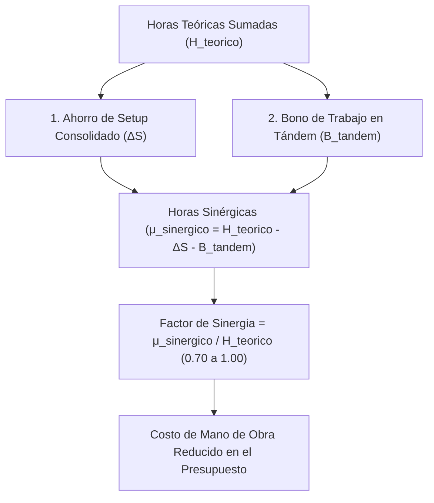

# Modelo Simplificado de Sinergia Determinística y Margen de Riesgo Global

> **Cotizador Eléctrico PWA - IEBA**  
> **Documento Maestro de Metodología de Cotización**  
> **Decisión de Producto:** *Esta aplicación es exclusivamente un cotizador ágil y preciso; no planifica obras, ni gestiona cuadrillas en el terreno, ni calcula liquidación laboral.*

---

## 1. Fundamento y Filosofía de Producto

Al momento de presupuestar una instalación eléctrica, existe una incertidumbre inherente respecto al estado real de las canalizaciones y las condiciones ocultas del inmueble. Intentar modelar esta incertidumbre mediante variables estadísticas finas ($\sigma_i$, distribuciones normales, percentiles $Z_p$ y correlaciones complejas) introduce una **falsa precisión matemática** que añade complejidad y fragilidad al código sin mejorar el precio que se le presenta al cliente.

Por tanto, el sistema adopta dos principios rectores claros y pragmáticos:

1. **Sinergia Determinística ($\mu_{\text{sinérgico}}$):** Modela el ahorro físico y real de tiempos muertos cuando se combinan múltiples tareas en un mismo lugar y se trabaja con una cuadrilla estándar de 2 o más operarios (Consolidación de Setup + Bono de Trabajo en Tándem).
2. **Margen de Riesgo Global Configurable (`margen_riesgo`):** Un colchón porcentual explícito y visible (Bajo $+10\%$, Medio $+20\%$, Alto $+35\%$ o personalizado) aplicado sobre el costo directo total para absorber imprevistos de obra, roturas y demoras.

---

## 2. Modelo de Sinergia Determinística ($\mu_{\text{sinérgico}}$)

Cuando un presupuesto contiene **2 o más partidas compatibles con mano de obra real**, el cálculo determinista reduce las horas totales según dos factores físicos:



### 2.1. Consolidación de Tiempos de Setup (Alistamiento de Puesto)
Cada tarea cotizada en forma aislada contempla tiempos para subir herramientas, replantear y preparar el puesto:
$$S_{\text{aislado}} = \sum_{i=1}^n \min(1.0\text{ h}, \max(0.25\text{ h}, H_i \times 0.15))$$

Al ejecutarse en una misma visita de obra, el alistamiento general se realiza una sola vez para todo el conjunto:
$$S_{\text{consolidado}} = 1.0\text{ h} + 0.15\text{ h} \times (n - 1)$$

El ahorro neto en horas de setup es:
$$\Delta S = \max(0, S_{\text{aislado}} - S_{\text{consolidado}})$$

### 2.2. Bono de Productividad en Tándem (Cuadrilla de 2+ Operarios)
La cantidad de operarios ($n_{\text{operarios}}$) es un **dato de entrada manual** ingresado por el usuario (por defecto: `2 operarios`):
- **Si $n_{\text{operarios}} \ge 2$:** Se aplica una ganancia de productividad del **$10\%$** en tareas simultáneas (tracción de cables, pasacables con lubricante, montaje en paralelo):
  $$B_{\text{tándem}} = 0.10 \times H_{\text{teórico}}$$
- **Si $n_{\text{operarios}} = 1$:** No hay trabajo en tándem ($B_{\text{tándem}} = 0$).

### 2.3. Horas Sinérgicas Finales y Factor Aplicado
$$\mu_{\text{sinérgico}} = \max(0.1\text{ h}, H_{\text{teórico}} - \Delta S - B_{\text{tándem}})$$

$$\text{Factor de Sinergia} = \frac{\mu_{\text{sinérgico}}}{H_{\text{teórico}}} \quad (\text{típicamente entre } 0.75 \text{ y } 0.90)$$

### 2.4. Tiempo de Obra en Reloj y Jornadas Estimadas
Existe una diferencia clave entre **Consumo de Mano de Obra (Costo)** y **Tiempo de Obra (Plazo / Duración)**:
- **Horas-Hombre (HH):** $\mu_{\text{sinérgico}}$ (volumen de trabajo a liquidar).
- **Horas de Reloj en el Sitio ($T_{\text{reloj}}$):** Tiempo de intervención física:
  $$T_{\text{reloj}} = \frac{\mu_{\text{sinérgico}}}{n_{\text{operarios}}}$$
- **Jornadas Estimadas ($D$):** Considerando $H_{\text{efectivas}} = 7.0\text{ hs}$ netas de herramienta por jornal (absorbiendo apertura, guardado de herramientas y pausas diarias):
  $$D = \frac{\mu_{\text{sinérgico}}}{n_{\text{operarios}} \times H_{\text{efectivas}}}$$

### 2.5. Composición de Roles de Cuadrilla y Tarifas Ponderadas
Cada categoría en el catálogo de Mano de Obra posee un campo semántico **`rol`** (`oficial`, `ayudante`, `especialista`, `independiente`). La cuadrilla se compone dinámicamente según el tamaño seleccionado:

| Operarios ($n$) | Composición | Justificación Técnica | Tarifa Ponderada ($T_{\text{ponderada}}$) |
| :--- | :--- | :--- | :---: |
| **1 Operario** | **1 Oficial** | Tareas individuales o services. | $T_{\text{oficial}}$ |
| **2 Operarios** | **1 Oficial + 1 Ayudante** | 1 Tándem de tracción y enhebrado. | $\frac{T_{\text{of}} + T_{\text{ay}}}{2}$ |
| **3 Operarios** | **2 Oficiales + 1 Ayudante** | 1 Tándem (Of+Ay) + 1 Oficial autónomo en conexiones/cierre. | $\frac{2 \cdot T_{\text{of}} + T_{\text{ay}}}{3}$ |
| **4 Operarios** | **2 Oficiales + 2 Ayudantes** | 2 Tándems independientes en paralelo. | $\frac{T_{\text{of}} + T_{\text{ay}}}{2}$ |

---

## 3. Modelo de Riesgo Natural por Componente (Sin Duplicación)

Para evitar duplicaciones y sobre-recargos artificiales, la contingencia de obra se asigna a su causa natural:

1. **Mano de Obra (Dificultad de Ejecución en el Ítem):**
   - Cada partida se evalúa según el esfuerzo de herramienta en el sitio:
     - **Favorable ($0.90\times$):** Cañería nueva, vacía, baja altura.
     - **Normal ($1.00\times$):** Condiciones estándar.
     - **Dificultosa ($1.25\times$ a $1.40\times$):** Altura con andamio, caños viejos de hierro, losa de hormigón macizo.
2. **Materiales (Merma & Desperdicio):**
   - Se cubre en el cómputo del insumo (ej: $+10\%$ en conductores para empalmes y recortes) o mediante un Gasto Directo sobre Insumos (+5% acopio/roturas).
3. **Logística de Cuadrilla:**
   - Devengada por Jornadas Enteras de Convenio y fletes por visita física.

---

## 4. Tipos TypeScript Resultantes

```typescript
// 1. Niveles de Margen de Riesgo Global
export type NivelMargenRiesgo = 'bajo' | 'medio' | 'alto' | 'personalizado';

// 2. Estructura de Sinergia Determinística
export interface SinergiaPresupuesto {
  operarios: number; // Entrada manual (default: 2)
  horasTeoricasTotal: number;
  horasSetupAislado: number;
  horasSetupConsolidado: number;
  ahorroSetupHs: number;
  bonoTandemHs: number;
  horasFinales: number;
  factorSinergia: number; // e.g. 0.82
  costoManoObraBase: number;
  costoManoObraSinergico: number;
  ahorroManoObraARS: number;
  sonCompatibles: boolean;
  explicacion: string;
}

// 3. Extensión en la entidad Presupuesto
export interface Presupuesto {
  // ... campos generales ...
  operariosCuadrilla?: number; // Default: 2
  margenRiesgoPorcentaje?: number; // e.g. 20 (para +20%)
  nivelMargenRiesgo?: NivelMargenRiesgo; // 'bajo' | 'medio' | 'alto' | 'personalizado'
  aplicarSinergiaManoObra?: boolean;
  factorSinergiaManoObra?: number; // Factor aplicado a la MOD
  sinergiaManoObra?: SinergiaPresupuesto;
}
```

---

## 5. Registro de Conceptos y Secciones Eliminadas del Alcance

Para mantener la integridad conceptual del proyecto y evitar referencias obsoletas, se deja constancia formal de lo que fue **eliminado definitivamente del alcance**:

1. **Aparato Estocástico Fino:**
   - Eliminados: Desvío estándar por tarea ($\sigma_i$), varianza acumulada ($\sigma_{\text{total}}$), niveles de certeza gaussiana ($Z_p$), coeficientes de variación porcentual ($CV$).
2. **Regímenes Horarios Laborales (LCT 20.744 / UOCRA):**
   - Eliminados: Diurno vs Nocturno vs Horas Extras 50% vs Fin de Semana 100%.
   - **Limitación explícita:** La app asume siempre jornada estándar diurna. Si se requiere un recargo por trabajo fuera de hora, el instalador ajusta la tarifa horaria de la categoría o aplica un margen de riesgo mayor.
   - Tipos eliminados: `RegimenHorarioObra`, `ConfiguracionRegimenHorario`.
3. **Ventana Fija / Parada de Planta (Time-Boxing):**
   - Eliminado: Dimensionamiento inverso de cuadrillas obligatorias por límite de horas de corte.
4. **Simulador de 3 Estrategias de Cuadrilla con Búsqueda Iterativa:**
   - Eliminados: Comparador de cuadrillas Mínima (1 op) vs Óptima (2 ops) vs Rápida (4 ops) con cálculo de días y riesgo de parate.
   - La cantidad de operarios pasa a ser un **dato de entrada manual simple**.
   - Tipos eliminados: `OpcionCuadrillaSimulada`, `EstrategiaCuadrilla`.
