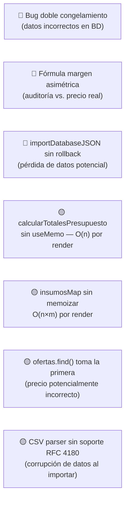

# Análisis de Lógica de Negocio — Cotizador Eléctrico IEBA

## Contexto del Sistema

El sistema es una **PWA offline-first** (IndexedDB via Dexie) para cotización de obras eléctricas. Tiene 24 componentes y un núcleo de cálculo puro en `calculations.ts`. El modelo de datos es local-first con 15 tablas Dexie y un campo `syncStatus` preparado para sincronización futura con Firebase.

---

## Mapa del Flujo de Datos Principal

```mermaid
graph TD
    A[DB: insumos / materiales / ofertas] -->|insumosMap| B[calcularCostoTareaTipo]
    C[DB: manoObra] -->|manoObraMap| B
    D[DB: tareasTipo] --> B
    B --> E[ItemPresupuesto con snapshots unitarios]
    E -->|handleUpdateItemQuantity| F[congelarItemPresupuesto]
    F --> G[items[] en estado React]
    G -->|en cada render| H[calcularTotalesPresupuesto]
    H --> I[totales: ARS, USD, margen, impuestos]
    G -->|al emitir| J[congelarItemPresupuesto x2 ⚠️]
    J --> K[DB: presupuestos.put]
    
    L[DB: registrosTrabajo] -->|al cargar| M[calcularNuevoFactorEMA]
    M -->|update| D
    
    D --> N[auditarRentabilidadTareaTipo]
    A --> N
    C --> N
```

---

## Análisis de `calculations.ts`

### ✅ Fortalezas

| Aspecto | Detalle |
|---|---|
| `roundMoney()` global | Previene drift de IEEE 754. Aplicado consistentemente en todos los intermedios. |
| `safeNum()` interno | Defensivo ante `null`, `undefined`, `NaN`, `Infinity`. Bien propagado. |
| Funciones puras | Todas son deterministas y sin side-effects. Fácilmente testeables (y hay tests). |
| Snapshotting | La "regla de oro" (§1.5) está bien implementada: los precios se congelan al emitir. |
| EMA con clamp | `calcularNuevoFactorEMA` limita el factor a `[0.1, 10.0]`, evitando divergencia. |

---

### 🔴 Bugs y Problemas Críticos

#### 1. Doble congelamiento en `handleSavePresupuesto` (BUG REAL)

```typescript
// PresupuestoEditor.tsx L442 — al cambiar cantidad:
const itemRecalculado = congelarItemPresupuesto(target, cant);

// PresupuestoEditor.tsx L509 — al guardar:
const itemsFrozen = items.map((item) => congelarItemPresupuesto(item, item.cantidad));
```

**Problema**: `congelarItemPresupuesto` multiplica `cantidadTotal` y `horasTotales` por la cantidad. Si el ítem ya fue congelado en `handleUpdateItemQuantity`, al guardarlo se **vuelve a multiplicar** por la misma cantidad.

**Ejemplo concreto**: 3 unidades de cable 2.5mm², cantidad del snapshot unitario = 10m.
- Tras `handleUpdateItemQuantity(idx, 3)`: `cantidadTotal = 10 * 3 = 30m`
- Al guardar: `congelarItemPresupuesto({cantidadTotal: 30}, 3)` → `cantidadTotal = 30 * 3 = 90m` ❌

**Efecto**: Los snapshots guardados en `presupuestos` tienen cantidades e importes inflados por el cuadrado de la cantidad.

> [!CAUTION]
> Este bug afecta directamente la integridad financiera de los presupuestos emitidos. El PDF o detalle que se imprima tendrá líneas de materiales con cantidades incorrectas.

**Solución**: En `handleSavePresupuesto`, usar los items tal cual (no re-congelar), o hacer que `congelarItemPresupuesto` sea idempotente verificando si ya fue congelado.

---

#### 2. `precioVentaUnitario` vs. `margenPorcentaje` — Fórmula asimétrica

En `handleAddTareaTipoItem` (L327):
```typescript
const precioVentaUnitario = Math.round(costoDirectoUnitario * (1 + margenPorcentaje / 100));
```

En `auditarRentabilidadTareaTipo` (L650):
```typescript
const factorMargen = 1 - (margenPorcentaje / 100);
const precioVentaSugerido = roundMoney(costoDirecto / factorMargen);
```

**Problema**: Son dos convenciones de margen distintas:
- `markup`: precio = costo × (1 + margen%) → margen sobre costo
- `margin`: precio = costo / (1 - margen%) → margen sobre precio de venta

Para un margen del 35%:
- `markup`: precio = 100 × 1.35 = **$135** (margen real sobre precio = 25.9%)
- `margin`: precio = 100 / 0.65 = **$153.85** (margen real sobre precio = 35%)

El `PresupuestoEditor` usa **markup**, el motor de auditoría usa **margin**. El `montoGanancia` en `calcularTotalesPresupuesto` se calcula como `precioVenta - costoTotal`, por lo que el % real que el usuario ve no corresponde al `margenPorcentaje` ingresado.

> [!WARNING]
> Esta asimetría genera que la "Advertencia de Margen Bajo" y la auditoría de rentabilidad calculen umbrales distintos al precio real que se cobra al cliente.

---

#### 3. Precio del material: `ofertas.find()` solo toma la primera oferta

En `PresupuestoEditor.tsx` (L78):
```typescript
const oferta = ofertas.find(o => o.materialId === m.id);
```

`Array.find()` retorna el **primer match** sin criterio de fecha ni preferencia de proveedor. Si un material tiene múltiples ofertas de distintos proveedores, siempre se usará la primera en el array de IndexedDB (orden de inserción). Esto puede llevar a usar precios desactualizados o de proveedores no preferidos.

> [!WARNING]
> El historial de ofertas existe pero se ignora aquí. Existe toda la infraestructura (`Oferta.fecha`, `Producto.esPreferido`) para seleccionar la mejor oferta, pero no se usa.

---

### 🟡 Problemas Medianos

#### 4. `calcularTotalesPresupuesto` se llama en cada render

```typescript
// PresupuestoEditor.tsx L312 — fuera de cualquier useMemo
const totales = calcularTotalesPresupuesto({ items, ... });
```

Esta función itera todos los ítems, todos sus snapshots, y todos los costos indirectos **en cada render del componente**. Para un presupuesto con 20+ ítems y múltiples snapshots cada uno, esto es trabajo O(n) innecesario en renders que no cambian los datos (e.g., hover, scroll).

**Solución**: Envolver en `useMemo` con dependencias `[items, costosIndirectosConfig, margenPorcentaje, impuestosDetalle, mostrarDolar, cotizacionDolar]`.

---

#### 5. `insumosMap` reconstruido en cada render sin memoización

```typescript
// PresupuestoEditor.tsx L75-L89
const insumosMap = new Map<string, Insumo>();
legacyInsumos.forEach(i => insumosMap.set(i.id, i));
materiales.forEach(m => {
  const oferta = ofertas.find(o => o.materialId === m.id); // O(n) por cada material
  insumosMap.set(m.id, { ... });
});
```

Este bloque ejecuta un `Array.find()` **por cada material** en cada render. Si hay 500 materiales y 1000 ofertas, esto es ~500,000 comparaciones por render.

**Solución**: 
1. `useMemo` para el mapa completo
2. Pre-indexar ofertas como `Map<materialId, Oferta>` para lookup O(1)

---

#### 6. `calcularDispersionHorasTareaLegacy` — spread operator en arrays potencialmente grandes

```typescript
const minRatio = Math.min(...ratios); // spread de N elementos
const maxRatio = Math.max(...ratios);
```

Con muchos registros de trabajo, el spread puede causar `RangeError: Maximum call stack size exceeded`. La alternativa es `reduce`.

---

#### 7. `handleUpdateItemCondicion` no preserva el factor EMA

```typescript
const manoObraActualizada = target.manoObraSnapshot.map(mo => {
  const horasAjustadas = mo.horasTotales * mult;
  return { ...mo, subtotalManoObra: roundMoney(mo.costoHoraCongelado * horasAjustadas) };
});
```

El multiplicador de condición (`mult`) se aplica a `horasTotales`, que en el snapshot congelado **ya incluye la cantidad**. Si el ítem tiene cantidad > 1, las horas ya están multiplicadas y el resultado es `horasTotales_congeladas × mult` en vez de `horasUnitarias × factorEMA × mult × cantidad`.

---

## Análisis de `database.ts` (Dexie)

### ✅ Fortalezas

| Aspecto | Detalle |
|---|---|
| Versionado incremental | Las 3 versiones son aditivas y correctas. |
| Transacciones en seed | `initializeDatabaseSeed` usa `transaction('rw', [...])` — correcto. |
| bulkAdd en CSV import | Eficiente para inserción masiva. |
| Índices explícitos | Se indexan los campos de búsqueda frecuente (`clienteId`, `estado`, `fecha`, etc.). |

---

### 🔴 Problemas Críticos en Dexie

#### 8. `importDatabaseJSON` usa `bulkAdd` en lugar de `bulkPut`

```typescript
await db.materiales.clear();
await db.materiales.bulkAdd(data.materiales);
```

El `clear()` + `bulkAdd()` es una operación destructiva sin rollback granular. Si `bulkAdd` falla a mitad (e.g., por registro duplicado o schema mismatch), la tabla queda **vacía y sin datos recuperados**. `bulkPut` es más seguro (upsert).

> [!CAUTION]
> Una importación fallida puede dejar la base de datos en estado inconsistente con tablas en blanco.

---

#### 9. Índice `razonSocial` agregado en v2 pero no en v1

```typescript
// v1: proveedores: 'id, nombre, cuit'
// v2: proveedores: 'id, razonSocial, nombre, cuit'
```

Los registros insertados con v1 que tengan `razonSocial` vacío o `undefined` no serán encontrados por queries sobre ese índice. Dexie indexa `undefined` como ausente. Dado que `Proveedor.razonSocial` es obligatorio en el tipo pero los datos legacy no lo tenían, puede haber proveedores "invisibles" en búsquedas por `razonSocial`.

---

#### 10. `importInsumosCSV` — split por coma sin soporte de campos entre comillas con coma

```typescript
const cols = lines[i].split(',').map(c => c.trim().replace(/^"|"$/g, ''));
```

El `split(',')` simple rompe cualquier campo que contenga comas (e.g., `"Cable NYY, 4x6mm²"`). El replace de comillas solo quita las externas pero no parsea CSV estándar. Esto puede truncar o corromper nombres de materiales.

---

### 🟡 Ausencias Notables en el Schema

| Campo ausente | Impacto |
|---|---|
| No hay índice por `precioActual` en `insumos` | Imposible filtrar "materiales sin precio" eficientemente sin `.toArray()` completo |
| No hay índice por `fechaActualizacion` en `insumos` | El cálculo de vencimiento (`obtenerEstadoVencimientoInsumo`) requiere scan completo |
| `ofertas` no tiene índice compuesto `[materialId+fecha]` | El lookup del precio más reciente es O(n) sobre todas las ofertas |
| `registrosTrabajo` no indexa `fecha` sola | Filtros por rango de fecha requieren scan + filter en memoria |

---

## Resumen de Cuellos de Botella



| Severidad | Problema | Archivo | Línea aprox. |
|---|---|---|---|
| 🔴 Crítico | Doble congelamiento de snapshots | `PresupuestoEditor.tsx` / `calculations.ts` | L442 + L509 |
| 🔴 Crítico | Fórmula de margen asimétrica (markup vs margin) | `PresupuestoEditor.tsx` / `calculations.ts` | L327 vs L650 |
| 🔴 Crítico | `bulkAdd` sin rollback en importación JSON | `database.ts` | L214-L229 |
| 🟡 Medio | `calcularTotalesPresupuesto` sin `useMemo` | `PresupuestoEditor.tsx` | L312 |
| 🟡 Medio | `insumosMap` + `ofertas.find()` sin memoizar | `PresupuestoEditor.tsx` | L75-L89 |
| 🟡 Medio | `ofertas.find()` toma primera oferta (sin criterio fecha/proveedor) | `PresupuestoEditor.tsx` | L78 |
| 🟡 Medio | Índice `[materialId+fecha]` faltante en `ofertas` | `database.ts` | schema v3 |
| 🟢 Menor | `Math.min(...ratios)` con spread en array grande | `calculations.ts` | L265-L266 |
| 🟢 Menor | Parser CSV sin soporte RFC 4180 | `database.ts` | L243 |
| 🟢 Menor | Índice `razonSocial` en datos legacy sin migración | `database.ts` | v2 schema |
