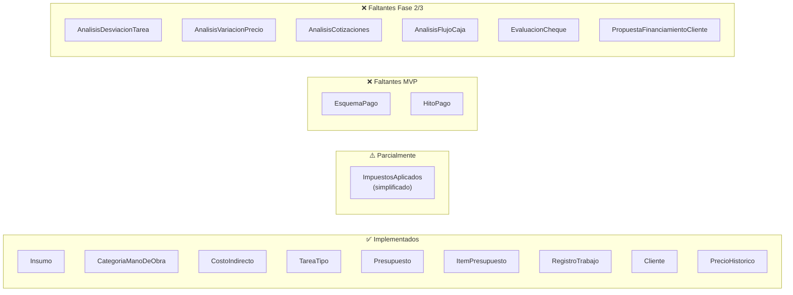

# 🔍 Auditoría Externa — Cotizador Eléctrico IEBA (PWA)

**Fecha**: 10 de agosto de 2026
**Auditor**: Auditoría técnica automatizada (externo)
**Referencia**: [spec-cotizador-electrico.md](file:///c:/Users/federico/Desktop/IEBA/pwaCotizadorIeba/spec-cotizador-electrico.md)
**Alcance**: Usabilidad, interfaz, prolijidad y coherencia de código vs. especificación

---

## Resumen Ejecutivo

| Severidad | Cantidad | Descripción |
|---|---|---|
| 🔴 CRITICAL | **1** | Riesgo de errores acumulativos en cálculos monetarios |
| 🟠 HIGH | **11** | Deuda técnica significativa con impacto funcional |
| 🟡 MEDIUM | **23** | Mejoras de calidad, consistencia y mantenibilidad |
| 🔵 LOW | **9** | Refinamientos menores |
| ℹ️ INFO | **2** | Observaciones positivas o contextuales |

**Veredicto general**: La aplicación es **funcional y tiene buena estética visual** (dark mode, glassmorphism, paleta amber/gold coherente). Sin embargo, presenta **deuda técnica importante** en tres ejes:

1. **Fidelidad al spec** — Faltan campos y modelos clave (historial de precios, costos indirectos snapshot, esquema de pago)
2. **Robustez de cálculos** — Aritmética de punto flotante para dinero + fórmulas incompletas
3. **Mantenibilidad** — Duplicación masiva de patrones CRUD + componentes UI excesivamente grandes

---

## 1. Adherencia al Spec (Modelo de Dominio)

### 1.1 Modelos implementados vs. requeridos



### 1.2 Hallazgos críticos

| # | Sev. | Archivos | Hallazgo | Ref. Spec |
|---|---|---|---|---|
| 1 | 🟠 | [types.ts](file:///c:/Users/federico/Desktop/IEBA/pwaCotizadorIeba/src/core/types.ts) | **`Insumo` sin `historialPrecios`**: El tipo `PrecioHistorico` existe pero no está referenciado desde `Insumo`. Esto es la pieza central del versionado de precios, marcado como *"crítico en Argentina"*. | §1.4 |
| 2 | 🟠 | [types.ts](file:///c:/Users/federico/Desktop/IEBA/pwaCotizadorIeba/src/core/types.ts) | **Faltan `EsquemaPago` / `HitoPago`**: El spec los marca como **MVP** (§7.5). El campo `condiciones_pago` del presupuesto es solo un string libre. | §7.1 |
| 3 | 🟡 | [types.ts](file:///c:/Users/federico/Desktop/IEBA/pwaCotizadorIeba/src/core/types.ts) | **`TareaTipo` sin `notasTecnicas`**: Falta el campo para referencia normativa (AEA 90364). | §1.6 |
| 4 | 🟡 | [types.ts](file:///c:/Users/federico/Desktop/IEBA/pwaCotizadorIeba/src/core/types.ts) | **`Presupuesto` sin `pdfGeneradoUrl`** ni `costosIndirectosAplicados` (snapshot). | §3 |
| 5 | 🟡 | [types.ts](file:///c:/Users/federico/Desktop/IEBA/pwaCotizadorIeba/src/core/types.ts) | **`RegistroTrabajo` sin campo `condicion`** (`'normal' \| 'dificultosa' \| 'favorable'`). | §6.1 |
| 6 | ℹ️ | [types.ts](file:///c:/Users/federico/Desktop/IEBA/pwaCotizadorIeba/src/core/types.ts) | **`Proveedor` es una adición válida** no definida en el spec, pero coherente con `proveedor_preferido` del `Insumo`. | — |

---

## 2. Lógica de Cálculos

> [!CAUTION]
> ### CRITICAL: Aritmética de punto flotante para dinero
> [calculations.ts](file:///c:/Users/federico/Desktop/IEBA/pwaCotizadorIeba/src/core/calculations.ts) usa `number` (IEEE 754) para todos los cálculos monetarios. El spec usa `Decimal` explícitamente. En presupuestos con decenas de ítems, los errores de redondeo se acumulan y pueden generar diferencias de centavos/pesos que afectan la profesionalidad del PDF y la auditabilidad.
>
> **Solución**: Usar `decimal.js` o `big.js`, o al mínimo redondear consistentemente en cada paso intermedio.

| # | Sev. | Archivo | Hallazgo |
|---|---|---|---|
| 7 | 🔴 | [calculations.ts](file:///c:/Users/federico/Desktop/IEBA/pwaCotizadorIeba/src/core/calculations.ts) | **Aritmética de punto flotante para dinero** (ver caution arriba) |
| 8 | 🟠 | [calculations.ts](file:///c:/Users/federico/Desktop/IEBA/pwaCotizadorIeba/src/core/calculations.ts) | **Snapshot no congela costos indirectos**: Al emitir un presupuesto, los precios de insumos y mano de obra se copian, pero los costos indirectos se recalculan al vuelo. Esto viola la "regla de oro" del spec §1.5. |
| 9 | 🟠 | [calculations.ts](file:///c:/Users/federico/Desktop/IEBA/pwaCotizadorIeba/src/core/calculations.ts) | **Solo implementa 1 de 3 tipos de costos indirectos**: Solo `porcentual_sobre_costo`. Falta `fijo_mensual` y `por_visita` (§1.3). |
| 10 | 🟡 | [calculations.ts](file:///c:/Users/federico/Desktop/IEBA/pwaCotizadorIeba/src/core/calculations.ts) | **Sin validación de inputs**: Cantidades negativas, precios `NaN`, listas vacías pasan sin error. |
| 11 | 🟡 | [calculations.ts](file:///c:/Users/federico/Desktop/IEBA/pwaCotizadorIeba/src/core/calculations.ts) | **Sin JSDoc ni documentación de fórmulas**: Las funciones no referencian qué sección del spec implementan. |

---

## 3. Cobertura de Tests

| # | Sev. | Archivo | Hallazgo |
|---|---|---|---|
| 12 | 🟠 | [calculations.test.ts](file:///c:/Users/federico/Desktop/IEBA/pwaCotizadorIeba/src/core/calculations.test.ts) | **Solo happy paths**: Faltan tests para: presupuesto vacío, cantidades 0, márgenes negativos, snapshot inmutable, costos indirectos por tipo, redondeo con muchos decimales. |
| 13 | 🟡 | [calculations.test.ts](file:///c:/Users/federico/Desktop/IEBA/pwaCotizadorIeba/src/core/calculations.test.ts) | **Sin test de inmutabilidad del snapshot**: La "regla de oro" del spec no tiene un test que verifique que cambiar el precio de un insumo NO afecta un presupuesto ya emitido. |
| 14 | 🟡 | [calculations.test.ts](file:///c:/Users/federico/Desktop/IEBA/pwaCotizadorIeba/src/core/calculations.test.ts) | **Tests no aislados**: Datos hardcoded inline, sin fixtures compartidas. |

---

## 4. Base de Datos (Dexie/IndexedDB)

| # | Sev. | Archivo | Hallazgo |
|---|---|---|---|
| 15 | 🟡 | [database.ts](file:///c:/Users/federico/Desktop/IEBA/pwaCotizadorIeba/src/db/database.ts) | **Sin plan de migración de schema**: Solo `version(1)`. Agregar campos faltantes requerirá `version(2)` con migración. |
| 16 | 🟡 | [database.ts](file:///c:/Users/federico/Desktop/IEBA/pwaCotizadorIeba/src/db/database.ts) | **Sin índices secundarios**: Solo indexa por `id`. Falta indexar `categoria` en insumos, `estado`/`clienteId`/`fechaEmision` en presupuestos, etc. |
| 17 | 🟡 | [database.ts](file:///c:/Users/federico/Desktop/IEBA/pwaCotizadorIeba/src/db/database.ts) | **Seed data puede confundir en producción**: Si el usuario borra todo, los datos de ejemplo reaparecen al recargar. |
| 18 | 🔵 | [database.ts](file:///c:/Users/federico/Desktop/IEBA/pwaCotizadorIeba/src/db/database.ts) | **Sin export/import de DB**: Importante para una app offline-first con datos críticos de negocio. |

---

## 5. Usabilidad (UX)

| # | Sev. | Archivo(s) | Hallazgo |
|---|---|---|---|
| 19 | 🟠 | Todos los `*Manager.tsx` | **Sin confirmación de eliminación**: Un clic accidental borra datos irrecuperablemente. `db.*.delete(id)` se ejecuta sin dialog de confirmación. |
| 20 | 🟡 | [PresupuestoEditor.tsx](file:///c:/Users/federico/Desktop/IEBA/pwaCotizadorIeba/src/components/PresupuestoEditor.tsx) | **Sin indicador de guardado/carga**: No hay estado `isSaving` con feedback visual. |
| 21 | 🟡 | Todos los `*Manager.tsx` | **Sin loading states**: `useLiveQuery` devuelve `undefined` durante la carga inicial sin mostrar skeleton/spinner. |
| 22 | 🟡 | Todos los `*Manager.tsx` | **Validación de formularios insuficiente**: Solo valida `!name.trim()`, sin mensajes de error por campo. |
| 23 | 🟡 | [App.tsx](file:///c:/Users/federico/Desktop/IEBA/pwaCotizadorIeba/src/App.tsx) | **Sin router**: No hay URLs por vista, el botón "atrás" del navegador no funciona, no se puede compartir link a un presupuesto. |

---

## 6. Interfaz (UI)

| # | Sev. | Archivo(s) | Hallazgo |
|---|---|---|---|
| 24 | 🟠 | [Header.tsx](file:///c:/Users/federico/Desktop/IEBA/pwaCotizadorIeba/src/components/Header.tsx) | **Navegación móvil deficiente**: 7 pestañas no se adaptan bien a pantallas pequeñas. Considerar sidebar o menú "More...". |
| 25 | 🟡 | Todos los componentes | **Clases Tailwind de 100+ caracteres**: Dificulta lectura y mantenimiento. Extraer a componentes `Card`, `Button`, `Input`, `Badge`. |
| 26 | 🟡 | Todos los `*Manager.tsx` | **Layout de formularios inconsistente**: Algunos usan panel lateral, otros inline. Sin patrón unificado. |
| 27 | 🔵 | Varios | **Formato de moneda inconsistente**: Mezcla `toLocaleString('es-AR')` con formato manual. Crear `formatCurrency()` centralizado. |

---

## 7. Prolijidad y Mantenibilidad del Código

> [!WARNING]
> ### Duplicación masiva de patrones CRUD
> Los 6 managers repiten un patrón idéntico (~60% de código duplicado):
> ```
> useLiveQuery → useState form → handleAdd → handleEdit → handleDelete → resetForm → render list + form
> ```
> **Impacto**: ~15,000 líneas de código en managers que podrían reducirse a ~6,000 con un framework genérico.

| # | Sev. | Archivo(s) | Hallazgo |
|---|---|---|---|
| 28 | 🟠 | 6 `*Manager.tsx` | **Patrón CRUD duplicado en 6 archivos**: Crear `useCrudManager<T>` hook o componente genérico `CrudManager<T>`. |
| 29 | 🟠 | [PresupuestoEditor.tsx](file:///c:/Users/federico/Desktop/IEBA/pwaCotizadorIeba/src/components/PresupuestoEditor.tsx) | **Componente de 1000+ líneas**: Mezcla estado, búsqueda, cálculos y renderizado. Dividir en hook + subcomponentes (objetivo: <300 líneas por archivo). |
| 30 | 🟠 | Varios componentes | **Lógica de negocio mezclada con UI**: Cálculos de costos, generación de números correlativos, y lógica de snapshot se ejecutan dentro de componentes React en vez de funciones puras en `core/`. |
| 31 | 🟡 | [InsumosManager.tsx](file:///c:/Users/federico/Desktop/IEBA/pwaCotizadorIeba/src/components/InsumosManager.tsx) | **Lógica de import CSV embebida en el componente**: Extraer a `src/core/csvImporter.ts` como función pura testeable. |
| 32 | 🟡 | Múltiples | **Magic strings para estados/categorías**: `'borrador'`, `'enviado'`, etc. sin enum centralizado. Definir en `types.ts`. |
| 33 | 🟡 | [types.ts](file:///c:/Users/federico/Desktop/IEBA/pwaCotizadorIeba/src/core/types.ts) | **IDs generados con `Date.now()`**: Riesgo de colisión. Usar `crypto.randomUUID()`. |
| 34 | 🟠 | [types.ts](file:///c:/Users/federico/Desktop/IEBA/pwaCotizadorIeba/src/core/types.ts) | **Sin validación Zod**: El spec lo pide explícitamente (§4). Los tipos TS desaparecen en runtime; no hay validación de datos que entran/salen de IndexedDB. |

---

## 8. Accesibilidad

| # | Sev. | Archivo(s) | Hallazgo |
|---|---|---|---|
| 35 | 🟠 | Todos los `*Manager.tsx` | **Inputs sin labels**: Usan solo `placeholder`, invisible para screen readers. Agregar `<label htmlFor>` o `aria-label`. |
| 36 | 🟡 | Todos los componentes | **Botones de iconos sin `aria-label`**: Botones de editar/eliminar solo tienen icono, sin texto accesible. |
| 37 | 🟡 | [Header.tsx](file:///c:/Users/federico/Desktop/IEBA/pwaCotizadorIeba/src/components/Header.tsx) | **Pestañas sin roles ARIA**: Falta `role="tablist"` / `role="tab"` y navegación por teclado con flechas. |

---

## 9. Aspectos Positivos ✅

Es importante también documentar lo que está bien hecho:

- **Estética visual sólida**: Dark mode consistente, paleta amber/gold coherente con la marca IEBA, glassmorphism bien aplicado, tipografía Outfit + JetBrains Mono es buena elección.
- **Offline-first con Dexie**: Decisión correcta de usar IndexedDB para funcionamiento sin conexión.
- **Separación core/componentes**: Existe una separación inicial en carpetas (`core/`, `components/`, `db/`), lo cual es un buen punto de partida.
- **Tests existentes**: Aunque insuficientes, el hecho de tener un archivo de tests con `vitest` configurado es positivo.
- **Sample data realista**: Los datos de ejemplo son coherentes con el dominio eléctrico argentino.
- **Print CSS**: Hay estilos de impresión con `.no-print` y `.printable-document`.
- **SEO basics**: Meta description, title, theme-color, lang="es" están presentes.
- **PWA-ready**: Aunque falta el service worker y el manifest, la arquitectura offline-first está orientada correctamente.

---

## 10. Plan de Acción Recomendado (por prioridad)

### 🔴 Inmediato (bloquea calidad del producto)

1. **Implementar aritmética decimal** para cálculos monetarios (`decimal.js` o redondeo consistente)
2. **Agregar confirmación de eliminación** en todos los managers
3. **Congelar costos indirectos** en el snapshot del presupuesto

### 🟠 Corto plazo (deuda técnica alta)

4. Agregar `historialPrecios` al modelo `Insumo`
5. Implementar los 3 tipos de costos indirectos
6. Agregar validación Zod en runtime
7. Extraer lógica de negocio de componentes UI a `core/`
8. Implementar `EsquemaPago` / `HitoPago` (es MVP según spec)
9. Agregar `aria-label` y `<label>` a todos los inputs

### 🟡 Mediano plazo (calidad y mantenibilidad)

10. Crear framework CRUD genérico para reducir duplicación
11. Descomponer `PresupuestoEditor` en subcomponentes + hook
12. Implementar router (hash-based mínimo)
13. Agregar tests de edge cases y snapshot inmutable
14. Extraer CSV import a función pura testeable
15. Agregar índices secundarios a la DB

### 🔵 Nice-to-have

16. Export/import de base de datos completa
17. Función `formatCurrency()` centralizada
18. Service worker + manifest para PWA completa
19. Migrar IDs a `crypto.randomUUID()`
20. Fixtures compartidas para tests

---

> [!NOTE]
> Esta auditoría se realizó sobre el estado actual del código sin ejecutar la aplicación. Se recomienda una sesión de testing manual (o E2E con Playwright) para validar los flujos de usuario en el navegador, especialmente el flujo completo de: crear presupuesto → agregar ítems → emitir → generar PDF → verificar que los precios del snapshot no cambien al actualizar insumos.
