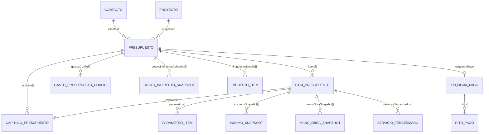

# Modelo de Datos de una Cotización (`Presupuesto`)

En el sistema **Cotizador IEBA**, una cotización se modela a través de la entidad agregada central [`Presupuesto`](file:///home/federico@uba-ilse.com.ar/pwaCotizadorIeba/src/core/types.ts#L747). Esta entidad implementa una arquitectura desacoplada basada en **Análisis de Precios Unitarios (APU)**, unificación de ítems (tanto tareas de catálogo como ítems propios o ad-hoc), congelamiento de costos mediante *snapshots* inmutables, resolución en cascada de parámetros/fórmulas y una cascada determinística de costos directos, margen de riesgo, gastos generales, beneficio e impuestos ($C \to \text{Riesgo} \to GG \to B \to \text{Impuestos} \to K$).

---

## 1. Jerarquía y Terminología Unificada

La jerarquía del modelo se organiza estrictamente en tres niveles normalizados:

| Nivel | Nombre de Entidad | Código TypeScript | Ejemplos |
| :---: | :--- | :--- | :--- |
| **0** | **Cotización** | [`Presupuesto`](file:///home/federico@uba-ilse.com.ar/pwaCotizadorIeba/src/core/types.ts#L747) | `COT-2026-0042`, `COT-2026-0042-R2` |
| **1** | **Capítulo** | [`CapituloPresupuesto`](file:///home/federico@uba-ilse.com.ar/pwaCotizadorIeba/src/core/types.ts#L707) | *Demoliciones*, *Instalaciones Eléctricas*, *Tableros* |
| **2** | **Ítem** (renglón o partida) | [`ItemPresupuesto`](file:///home/federico@uba-ilse.com.ar/pwaCotizadorIeba/src/core/types.ts#L591) | *Boca de iluminación general*, *Tablero seccional 24 polos* |

---

## 2. Diagrama Entidad-Relación



---

## 3. Estructura Principal: [`Presupuesto`](file:///home/federico@uba-ilse.com.ar/pwaCotizadorIeba/src/core/types.ts#L747)

El presupuesto es la raíz agregada que contiene los metadatos comerciales, las revisiones, los capítulos e ítems, las reglas de indirectos y los totales económicos derivados.

| Campo | Tipo | Descripción |
| :--- | :--- | :--- |
| `id` | `string` | Identificador único (UUID o formato `presup-xxx`). Clave primaria en IndexedDB. |
| `numero` | `string` | Código correlativo visible (ej. `COT-2026-0042` o `COT-2026-0042-R2`). |
| `revision` | `number` | Número de revisión secuencial (comienza en `1`). |
| `presupuestoOrigenId` | `string?` | ID de la cotización original cuando este registro es una nueva revisión generada. |
| `clienteId` | `string` | Referencia al [`Contacto`](file:///home/federico@uba-ilse.com.ar/pwaCotizadorIeba/src/core/types.ts#L237) (rol cliente). |
| `proyectoId` | `string?` | Referencia opcional al [`Proyecto`](file:///home/federico@uba-ilse.com.ar/pwaCotizadorIeba/src/core/types.ts#L693). |
| `direccionObra` | `string?` | Dirección específica del inmueble o sitio de instalación. |
| `fechaEmision` | `string` | Fecha de creación o emisión en formato ISO 8601. |
| `validezDias` | `number` | Plazo de validez comercial de la cotización (ej. 7, 15, 30 días). |
| `estado` | [`EstadoPresupuesto`](file:///home/federico@uba-ilse.com.ar/pwaCotizadorIeba/src/core/types.ts#L673) | `'borrador'` \| `'enviado'` \| `'aprobado'` \| `'rechazado'` \| `'vencido'`. |
| `tipoFactura` | [`TipoFactura`](file:///home/federico@uba-ilse.com.ar/pwaCotizadorIeba/src/core/types.ts#L675) | `'Factura A'` \| `'Factura B'` \| `'Factura C'` \| `'Presupuesto X (Sin Factura)'`. |
| `capitulos` | [`CapituloPresupuesto[]`](file:///home/federico@uba-ilse.com.ar/pwaCotizadorIeba/src/core/types.ts#L707) | Capítulos (Nivel 1) que agrupan los ítems. Pueden poseer variables locales de capítulo. |
| `items` | [`ItemPresupuesto[]`](file:///home/federico@uba-ilse.com.ar/pwaCotizadorIeba/src/core/types.ts#L591) | Ítems o renglones computables de obra (Nivel 2). |
| `gastosConfig` | [`GastoPresupuestoConfig[]`](file:///home/federico@uba-ilse.com.ar/pwaCotizadorIeba/src/core/types.ts#L719) | Reglas de gastos directos e indirectos (fijos, porcentuales o paramétricos). |
| `costosIndirectosAplicados`| [`CostoIndirectoSnapshot[]`](file:///home/federico@uba-ilse.com.ar/pwaCotizadorIeba/src/core/types.ts#L573) | Liquidación calculada de los gastos generales (GG). |
| `calculatedCells` | [`CalculatedCell[]?`](file:///home/federico@uba-ilse.com.ar/pwaCotizadorIeba/src/core/types.ts#L738) | Celdas reactivas con fórmulas evaluadas en tiempo real. |
| `calculosVariables` | `Record<string, number \| string>?` | Variables globales de la cotización accesibles desde fórmulas de ítems. |

> **Principio de Fuente Única de Verdad (Single Source of Truth):**
> El campo `dslText` **no se persiste** en la base de datos. El texto YAML del Modo Experto se genera bajo demanda a partir del modelo estructurado (`capitulos`, `items`, `calculosVariables`, `calculatedCells`, `gastosConfig`). La sincronización de texto a modelo ocurre **únicamente al presionar "Aplicar"**, previa validación sintáctica estricta, erradicando pisados involuntarios entre vistas.

---

## 4. Ítem Unificado: [`ItemPresupuesto`](file:///home/federico@uba-ilse.com.ar/pwaCotizadorIeba/src/core/types.ts#L591)

Un ítem manual y uno originado en una tarea tipo comparten la misma estructura de datos. El campo `tipoItem` opera meramente como metadato de procedencia sin bifurcar el comportamiento computacional.

### 4.1 Identificación y Parámetros
- `id`: Identificador del renglón.
- `capituloId?`: Vinculación con un [`CapituloPresupuesto`](file:///home/federico@uba-ilse.com.ar/pwaCotizadorIeba/src/core/types.ts#L707).
- `descripcion`: Descripción del trabajo o partida.
- `cantidad`: Cantidad principal computable del ítem.
- `formulaCantidad?`: Expresión matemática que calcula la cantidad principal (ej. `=superficie / 2`).
- `unidad`: Unidad de cómputo (`"boca"`, `"m"`, `"u"`, `"gl"`).
- `parametros?: ParametroItem[]`: Parámetros unificados del ítem:
  - `id`: Nombre de la variable auxiliar para fórmulas (ej. `altura`, `modulos`).
  - `nombre`: Etiqueta legible.
  - `unidad?`: Unidad del parámetro.
  - `valor`: Valor numérico actual evaluado.
  - `formula?`: Expresión opcional de cálculo (ej. `=ancho * 2`).
  - `opciones?`: Opciones predefinidas de selección `{ label, valor }`.
  - `origen?`: `'propio'` \| `'tarea_tipo'` \| `'capitulo'` \| `'cotizacion'`.
- `erroresFormulas?`: Diccionario de errores detectados (referencias circulares, variables no definidas o palabras reservadas) para visibilidad en UI sin quebrar el cálculo global.

> **Regla de la Palabra Reservada `cantidad`:**
> Cada ítem posee una única cantidad principal. En las fórmulas de sus líneas (insumos, mano de obra, servicios), el identificador `cantidad` está reservado y lee el valor de `item.cantidad`. Ningún parámetro auxiliar puede nombrarse `cantidad`.

### 4.2 Cascada de Resolución de Nombres
Al evaluar cualquier fórmula de un ítem, el motor resuelve las variables en el siguiente orden de precedencia estricto:
1. **Parámetros del Ítem** (`item.parametros`)
2. **Variables / Parámetros del Capítulo** (`capitulo.variables`, `capitulo.parametros`)
3. **Variables de la Cotización** (`calculosVariables`, `calculatedCells`)
4. **Valores por defecto de la Tarea Tipo** (`tareaTipo.parametros[].valorDefault`)

### 4.3 Desglose de Costos Directos (*Snapshots*)
Las líneas del ítem conservan precios unitarios congelados inmutables mientras sus cantidades se reevalúan dinámicamente:
- **`insumosSnapshot: InsumoSnapshot[]`**:
  - `insumoId`, `nombre`, `unidad`, `marca?`.
  - `cantidadUnitaria`: Consumo por unidad de ítem.
  - `cantidadTotal`: Volumen total de insumo para la partida.
  - `formulaCantidad?`: Fórmula dinámica de cantidad (ej. `=bocas * 3.5`).
  - `precioUnitarioCongelado`: Precio de adquisición congelado (inmutable ante recálculos de cantidad).
  - `subtotalInsumo`: `cantidadTotal * precioUnitarioCongelado`.
- **`manoObraSnapshot: ManoObraSnapshot[]`**:
  - `categoriaId`, `nombreCategoria`.
  - `horasUnitarias`: Rendimiento por unidad de ítem.
  - `horasTotales`: Horas-hombre totales para la partida.
  - `formulaHoras?`: Fórmula dinámica de horas (ej. `=cantidad * 0.75 + setup`).
  - `costoHoraCongelado`: Tarifa por hora congelada (inmutable ante recálculos de horas).
  - `subtotalManoObra`: `horasTotales * costoHoraCongelado`.
- **`serviciosTercerizados?: ServicioTercerizado[]`**:
  - Subcontratos, ensayos o alquileres con costo unitario, cantidad y total.

### 4.4 Ítems Vinculados a Tarea Tipo y Desacople
- `tareaTipoId?`: Identificador de la tarea tipo en catálogo.
- `tareaTipoVersion?`: Versión con la que fue instanciada la partida.
- `desacoplado?: boolean`:
  - Si un ítem está vinculado, sus parámetros se editan libremente.
  - Si el usuario edita directamente una línea de insumos o mano de obra, el ítem se marca como `desacoplado = true` preservando sus líneas actuales.
  - El usuario puede desacoplar manualmente o actualizar a una versión más reciente si la tarea tipo fue modificada en el catálogo.

---

## 5. Gastos, Costos Indirectos y Margen de Riesgo

### 5.1 Reglas de Gastos (`GastoPresupuestoConfig`)
- `destino`:
  - `'materiales'`: Recargo por flete, acopio o pérdidas sobre insumos.
  - `'mano_obra'`: Cargas sociales, viáticos o seguros sobre mano de obra directa.
  - `'servicios'`: Recargos sobre servicios tercerizados.
  - `'costo_indirecto'`: Gastos generales operativos y de estructura (GG).
- `modalidad`:
  - `'porcentual'`: Porcentaje aplicado sobre la base del destino.
  - `'monto_fijo'`: Importe en ARS asignado directamente.
  - `'parametrico'`: Resuelto por fórmula matemática según variables.
- `capituloId?`: Opcional. Si se especifica, aplica exclusivamente a las partidas de ese capítulo.

### 5.2 Margen de Riesgo Global
- `nivelMargenRiesgo`: `'bajo'` (10%), `'medio'` (20%), `'alto'` (35%) o `'personalizado'`.
- `margenRiesgoPorcentaje`: Porcentaje de contingencia aplicado directamente sobre los costos directos.
- `montoMargenRiesgo`: Monto en ARS resultante que amplía la base antes de aplicar GG y Beneficio.

*(Nota: Los modelos de sinergia estocástica y planificación de cuadrilla fueron descartados del sistema).*

---

## 6. Cascada de Cálculo y Totales Económicos

El motor puro [`calcularTotalesPresupuesto`](file:///home/federico@uba-ilse.com.ar/pwaCotizadorIeba/src/core/calculations.ts#L1315) procesa los valores en una cascada matemática determinística:

```
[Insumos + Mano de Obra + Servicios Directos] + [Gastos Directos de Mat/MO]
                                    ↓
                        Costo Directo Base
                                    ↓  +  Margen de Riesgo (%)
                          Costo Global (C)
                                    ↓  +  Gastos Generales Fijos y % (GG)
                       Base de Costo + GG
                                    ↓  +  Beneficio / Utilidad (%) (B)
                     Subtotal Sin Impuestos (S)
                                    ↓  +  Impuestos: IVA / IIBB / Tasas
                          Precio Final Global
```

### Campos Consolidados:
- `costoGlobal`: $C = \text{Costos Directos Totales} + \text{Margen de Riesgo}$.
- `gastosGeneralesTotal`: $GG = \Sigma(\text{GG fijos}) + \Sigma(\text{GG\%} \times C)$.
- `beneficioPorcentaje`: Margen de ganancia neto pretendido (ej. 30%).
- `beneficioMonto`: $B = \text{beneficioPorcentaje} \times (C + GG)$.
- `subtotalSinImpuestos`: $S = C + GG + B$.
- `montoImpuestosTotal`: Carga impositiva total calculada en base a [`impuestosDetalle`](file:///home/federico@uba-ilse.com.ar/pwaCotizadorIeba/src/core/types.ts#L677).
- `precioFinalGlobal`: Importe total a facturar al cliente en ARS ($S + \text{Impuestos}$).
- `coeficienteK`: Multiplicador unificado de venta ($K = \frac{\text{Precio Final}}{C}$). Permite conocer el factor de escala global de venta frente al costo directo.

---

## 7. Revisiones y Estados

- Los campos económicos derivados (`costoGlobal`, `precioFinalGlobal`, `costoInsumos`, `incidencia`, `precioFinalItem`, etc.) son valores de caché: se recalculan en vivo durante la edición y quedan congelados cuando la cotización se marca como `enviado` o `aprobado`.
- **Inmutabilidad de Revisiones**:
  - Al editar un presupuesto en estado `enviado` o `aprobado`, el sistema no sobrescribe el registro original.
  - En su lugar, clona el presupuesto como una nueva revisión en estado `borrador` con `revision: N + 1`, `numero: "COT-2026-0042-R(N+1)"` y `presupuestoOrigenId = original.id`.

---

## 8. Persistencia Offline-First (IndexedDB / Dexie.js)

El modelo se persiste en IndexedDB a través de Dexie en [`CotizadorDatabase`](file:///home/federico@uba-ilse.com.ar/pwaCotizadorIeba/src/db/database.ts#L33):

```typescript
// Esquema Versión 7 en database.ts
presupuestos: 'id, numero, clienteId, estado, fechaEmision, deleted, updatedAt, revision, presupuestoOrigenId'
```
